# Bamazon App

This is a simple node application using mySQL with 2 js files, a bamazonCustomer.js and a bamazonManager.js that have different functionality.

The customer file first displays a table of available items for purchase.

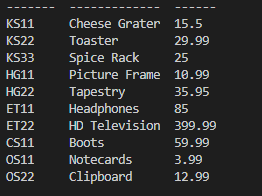

They are given a list of item ids to choose from to purchase.

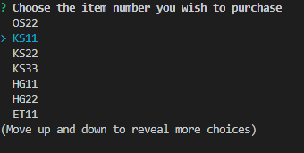

Then they are asked to choose the quantity that they would like to purchase, and they are then displayed their total for that purchase.

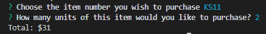

If there is not enough of the item to be purchased, the purchase will not go through and "Insufficient quantity" will be displayed instead.

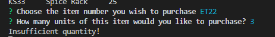

That's all the functionality for the customer file, moving on the the manager file.

The manager file first displays a select list of options: "View Products for Sale", "View Low Inventory", "Add to Inventory", and "Add New Product":

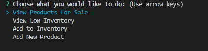

When you select the first option "View Products for Sale", the table of products for sale is displayed.

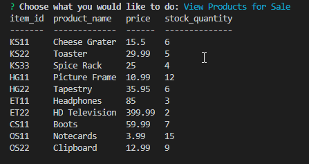

When you select the second option "View Low Inventory", the table of products with less than 5 stock quantity is displayed.

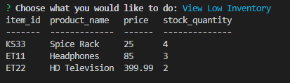

When selecing the option, "Add to Inventory", you are prompted with a list of items to add inventory to.

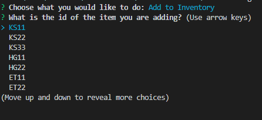

Then the user is prompted for the quantity they would like to add and the stock is then added to inventory.

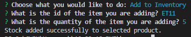

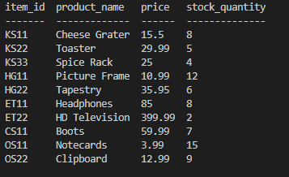

When you select "Add New Item", you are prompted with a series of questions about the new product that you are adding.

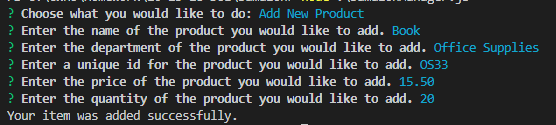

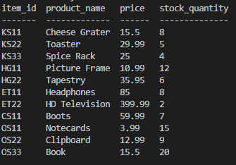
